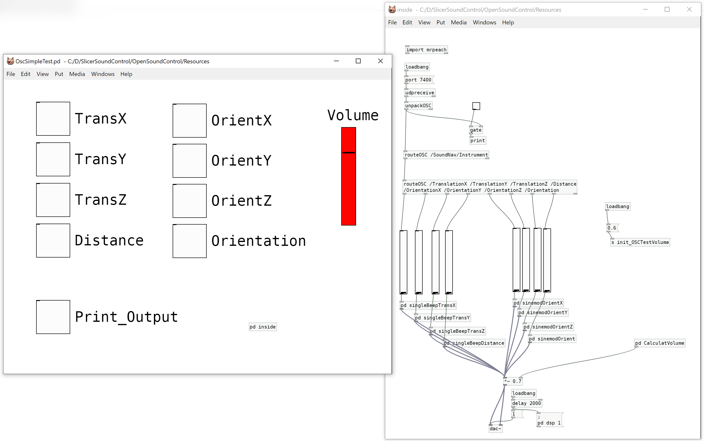
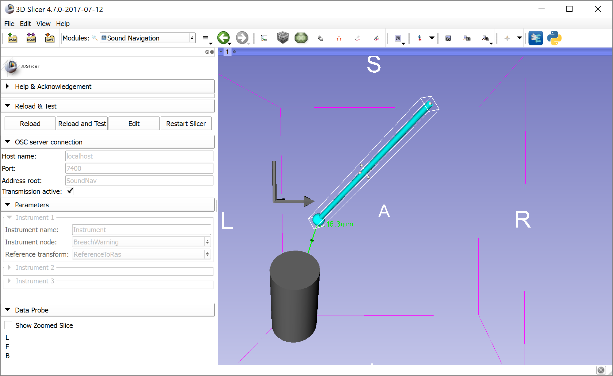

# SlicerSoundControl

3D Slicer extension to generate sound for feedback during navigation. Demo video: https://youtu.be/gSz8IHmogMo

Sound is generated by PureData (http://puredata.info), an open source visual programming language for multimedia.
To modulate generated sound based on navigated instrument position, orientation, etc., 3D Slicer sends parametersusing OpenSoundControl protocol.

**OpenSoundControl** module is for configuring and testing OpenSoundControl server communication.

**SoundNavigation** module is for automatic generation of OpenSoundControl messages for tool navigation, from tool and reference transform nodes.

It is recommended to download PureData distribution that includes plugins:

- https://github.com/agraef/purr-data/releases
- http://puredata.info/downloads/pd-extended (not maintained anymore but still working)

## Usage example: distance warning using breach warning module

This example explains how to set up sound warning, which indicates distance of a tool from a target structure. This example does not require tracking hardware, tool can be moved around using mouse+keyboard.

Installation:

- Install PureData
- Install 3D Slicer
- Start 3D Slicer
- Install SoundControl extension
- Install SlicerIGT extension (it contains BreachWarning module, which is used for computing distance of tooltip from a target model)

Setup:

- Start 3D Slicer
- Load BreachWarningScene.mrb
- Switch to "Open Sound Control module"
- In PureData section, select OscSimpleTest.pd configuration file, click "Start server" button
- Switch to "Sound Navigation" module
- Move the needle model by shift+left click & drag => moving the needle closer to the target will increase the beeping frequency
